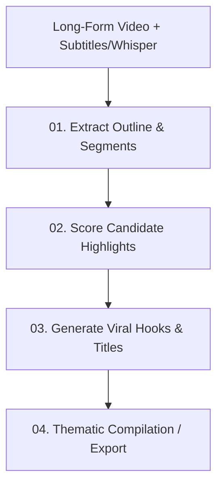

# AutoClip AI Prompt Library (English Edition)

This directory contains the complete collection of prompts, system instructions, and JSON schemas adapted from the **AutoClip** AI video clipping and highlight extraction pipeline, fully translated and enhanced in English.

---

## 📁 Directory Structure

```
autoclip-prompts/
├── README.md                                    # Architecture overview & integration guide
├── 00_system/
│   ├── base_system_prompt.md                   # Universal AI Video Editor persona & safety rules
│   └── json_schema_rules.md                    # Strict JSON output constraints & timestamp rules
├── 01_extract_outline/
│   ├── general_outline_prompt.md               # Universal video topic & boundary segmentation
│   ├── business_outline_prompt.md              # Finance, tech, business & interview structuring
│   ├── knowledge_outline_prompt.md             # Educational, documentary, & tutorial structuring
│   └── entertainment_outline_prompt.md         # Comedy, podcast, gaming, & vlog structuring
├── 02_highlight_scoring/
│   ├── universal_scoring_prompt.md             # Multi-factor highlight scoring formula (0–100)
│   ├── business_scoring_prompt.md              # High-value insights & actionable takeaway scoring
│   ├── knowledge_scoring_prompt.md             # "Aha!" realization & counterintuitive fact scoring
│   └── entertainment_scoring_prompt.md         # Emotional peaks, humor, & shock-value scoring
├── 03_generate_title/
│   ├── viral_hook_and_title_prompt.md          # 3-second visual hooks & high-CTR short titles
│   └── platform_optimized_titles.md            # Multi-platform formats (TikTok, Reels, Shorts)
└── 04_compilation_grouping/
    └── thematic_collection_prompt.md           # Grouping individual clips into highlight compilations
```

---

## ⚡ The 4-Stage Automated Pipeline



1. **Step 1: Outline Extraction**: Takes the raw Whisper transcript with timestamps and detects logical topic shifts and candidate segment boundaries (avoiding cutting mid-sentence).
2. **Step 2: Highlight Scoring**: Grades candidate clips against retention heuristics (Hook 30%, Core Value 40%, Standalone Clarity 20%, Viral Shareability 10%).
3. **Step 3: Hook & Title Generation**: Generates the first 3 seconds text hook overlay and high-CTR titles tailored for short-form algorithms (TikTok, YouTube Shorts, Instagram Reels).
4. **Step 4: Thematic Compilation**: Clusters related high-scoring clips into themed compilation reels (e.g., "Top 5 Mistakes", "Best Funny Moments").

---

## 🛠️ Variable Reference

When invoking these prompts via code (FastAPI, LangChain, or direct LLM API), inject the following variables:

| Variable | Description | Example |
| :--- | :--- | :--- |
| `{{transcript_with_timestamps}}` | Raw subtitle text with `[start_time --> end_time]` tags | `[00:01:15 --> 00:01:22] So the real secret is...` |
| `{{video_title}}` | Original title of the long-form video | `"How I Built a $10M SaaS in 12 Months"` |
| `{{video_category}}` | Category/Genre of the video | `"business"`, `"knowledge"`, `"entertainment"` |
| `{{min_clip_duration}}` | Minimum target duration for short clips (seconds) | `30` |
| `{{max_clip_duration}}` | Maximum target duration for short clips (seconds) | `90` |
| `{{min_score_threshold}}` | Minimum highlight score to qualify for clipping | `75` |
