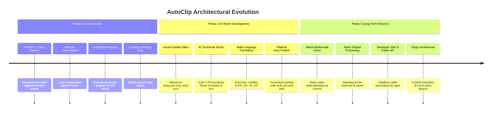

# AutoClip Roadmap & Architecture Benefits

This document outlines the official architectural roadmap of **AutoClip** (by `zhouxiaoka`), details its phased feature evolution, and explains the core technical and business benefits of adopting this architecture.

---

## 🗺️ The AutoClip Development Roadmap

---

### Phase 1: Core Foundation (Implemented & Stable)
* **Asynchronous Processing Engine**: Built on **FastAPI**, **Celery**, and **Redis** to prevent UI freezing during 1-hour+ video jobs.
* **Whisper Audio Extraction**: Extracts audio tracks and generates millisecond-accurate timestamped transcripts.
* **LLM Highlight Extraction**: Executes structured 4-stage prompt chains (Outline → Score → Title → Compilations).
* **Lossless Video Slicing**: Uses `ffmpeg -c copy` for near-instant video cutting without CPU/GPU re-encoding bottlenecks.
* **Real-time WebSockets**: Streams live percentage updates to the React web UI.

---

### Phase 2: Creator Studio Features (In Development)
1. **Interactive Subtitle & Timeline Editor**:
   * Visual waveforms and drag-and-drop handles to tweak clip start/end times with 0.1s precision.
   * Auto-generated animated captions (Word-by-word bounce/highlight effects).
2. **AI Thumbnail Generation**:
   * Evaluates video frames for emotional peaks and automatically extracts the best thumbnail stills with bold overlay text.
3. **Multi-Language Subtitle Translation**:
   * Auto-translates transcripts into Chinese, English, Japanese, and Korean for global cross-posting.
4. **Automated Platform Publishing**:
   * Direct API/Selenium-based scheduled uploads to YouTube Shorts, TikTok, and Bilibili with tag and title pre-filling.

---

### Phase 3: Advanced Scalability & Multimodal Vision (Long-Term)
1. **Multimodal Native Understanding**:
   * Upgrading from text-only transcripts to multimodal models (like **Gemini 3.7**) that can watch video motion and hear sound effects directly.
2. **Batch Queue & Channel Automation**:
   * Connect an RSS feed or YouTube channel ID to automatically monitor, transcribe, slice, and queue clips for every new upload.
3. **Open Developer API**:
   * Headless REST and WebSocket endpoints allowing third-party tools (like AutoFlow) to trigger automated clipping jobs programmatically.
4. **Extensible Plugin System**:
   * Support for custom audio ducking, automated B-roll insertion, and personalized brand watermarks.

---

## 💎 Core Benefits of This Architecture

### 1. 💰 Radical Cost Savings (No "SaaS Tax")
| Solution | Average Monthly Cost | Cost Per 10-Hour Video Processing |
| :--- | :--- | :--- |
| **Commercial SaaS (OpusClip, Klap, Vizard)** | $29 – $99 / month | Capped credits / Expensive overages |
| **AutoClip Architecture (+ Gemini / DeepSeek)** | **$0 / month** | **~$0.05 – $0.15 (API tokens only)** |

* **Why it matters:** Instead of paying recurring monthly subscription tiers with arbitrary credit limits, you only pay for raw compute and API tokens.

---

### 2. 🔒 Complete Privacy & Data Ownership
* **Local-First Processing:** Source video files and audio stay on your private machine or self-hosted Docker container.
* **No Third-Party Data Scraping:** Unreleased client footage, proprietary webinars, and confidential team calls are never uploaded to commercial third-party cloud SaaS platforms.

---

### 3. ⚡ High-Throughput Scalability
* **Decoupled Architecture:** Because the frontend (React), API (FastAPI), and Worker (Celery) are independent, you can run the web UI on a laptop while distributing video processing across multiple GPU machines or cloud instances.
* **Lossless Slicing (`ffmpeg -c copy`):** By copying video streams directly instead of re-rendering frames, a 60-second clip exports in **under 2 seconds**.

---

### 4. 🎯 100% Customizable Editorial Logic
* Commercial clipping tools force you into rigid, hardcoded templates and emojis.
* With AutoClip's open prompt architecture (found in [`autoclip-prompts/`](file:///c:/Users/HP%20PROBOOK/Desktop/autoflow/autoclip-prompts/README.md)), you can customize:
  * Highlight scoring thresholds.
  * Specialized niche definitions (Crypto, SaaS, Medical, Comedy).
  * Exact title styles, hook formulations, and caption hashtags.

---

## 🤝 Synergy with AutoFlow

Integrating this roadmap into **AutoFlow** creates a best-in-class workflow:
1. **Use AutoFlow Canvas Nodes** to orchestrate the video workflow visually.
2. **Use Gemini 3.7** to power the multimodal video understanding and viral scoring.
3. **Use the AutoClip FFmpeg Pipeline** to execute rapid, automated exports.
