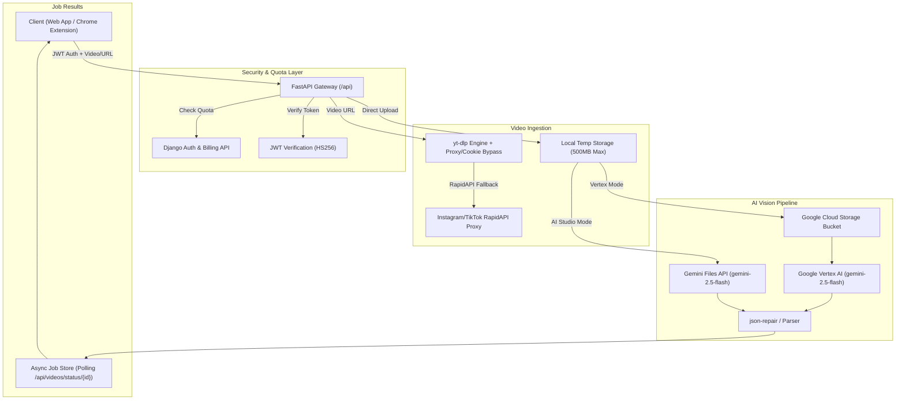

# 🎥 AutoFlow PromptExtractor — FastAPI AI Backend

> **Service:** Video-to-Prompt Reverse Engineering & Multimodal Analysis Engine  
> **Framework:** FastAPI (Python 3.12) + Uvicorn ASGI  
> **AI Vision Model:** Google Gemini 2.5 Flash (`google-genai` SDK / Vertex AI)  
> **Storage & Cloud:** Google Cloud Storage (GCS) + Supabase  
> **Deployment Target:** Railway / Render / Docker  

---

## 📖 1. Overview & Core Mission

**AutoFlow PromptExtractor** is a high-performance backend microservice that reverse-engineers raw video files and social media video URLs (YouTube, TikTok, Instagram Reels) into **production-ready AI prompts**, character turnaround sheets, voiceover transcriptions, and sequential shot-by-shot directions.

```
+─────────────────────────────────────────────────────────────────────────────+
|                         PromptExtractor Pipeline                            |
|                                                                             |
|  [ Video Upload / URL ] ───> [ yt-dlp / RapidAPI ] ───> [ GCS / Gemini ]    |
|                                                                │             |
|                                                                ▼             |
|  [ Production Shot Prompts ] <─── [ json-repair ] <─── [ Gemini 2.5 Flash ] |
|  [ Character Turnarounds   ]                                                |
|  [ Voiceover Dialogue      ]                                                |
+─────────────────────────────────────────────────────────────────────────────+
```

### Key Capabilities
1. **Multimodal Video Reverse-Engineering:**
   Extracts lighting, lenses, camera motion dynamics, character wardrobe, textures, and spoken audio into separate, ready-to-run prompts for **Google Veo**, **Midjourney**, **Runway Gen-3**, **Kling**, and **Luma Dream Machine**.
2. **Character Turnaround Generation:**
   Automatically detects characters in footage and writes multi-view design sheets (*"Studio rim lighting, concept art turnaround, neutral grey backdrop, 8k, UE5 render style"*).
3. **URL Downloader with Anti-Bot Bypasses:**
   Powered by `yt-dlp` with residential proxy support (`PROXY_URL`), browser cookie injection (`YT_DLP_COOKIES`), and RapidAPI proxy fallback for Instagram/TikTok datacenter unblocking.
4. **Dual AI Infrastructure:**
   - **Enterprise Mode (Vertex AI + GCS):** Streams large video payloads directly to Google Cloud Storage buckets with GCP service account authentication.
   - **Developer Mode (Google AI Studio):** Uses direct Gemini Files API with API keys.
5. **Quota Enforcement with AutoFlow Core:**
   Integrates with the main Django backend (`api.auto-flow.studio`) to enforce plan extraction quotas before processing heavy media files.

---

## 🏛️ 2. System Architecture



---

## 📁 3. Project Structure

```
extractor-backend/
├── app/
│   ├── __init__.py
│   ├── main.py                 # FastAPI application root, CORS & router registration
│   ├── config.py               # Pydantic BaseSettings (environment variables)
│   └── api/
│       ├── __init__.py
│       ├── health.py           # /api/health healthcheck endpoint
│       ├── videos.py           # Core video upload, URL extraction, and Gemini pipeline
│       └── gallery.py          # Public prompt gallery and search endpoints
├── Procfile                    # ASGI start command for Railway / Heroku
├── render.yaml                 # Render infrastructure deployment blueprint
├── requirements.txt            # Python dependencies (FastAPI, google-genai, yt-dlp, etc.)
├── .env.example                # Template for environment configuration
├── test_extractor.py           # Integration test script for live deployments
├── test_video.py               # Local video upload test
└── test_video2.py              # URL extraction verification test
```

---

## 🔌 4. API Endpoints Reference

### 1. Healthcheck
- **`GET /api/health`**
  - **Status:** `200 OK`
  - **Response:** `{"status": "healthy", "service": "prompt-extractor-api"}`

---

### 2. Video Upload & Extraction
- **`POST /api/videos/analyze`**
  - **Auth:** `Bearer <JWT_TOKEN>` (Required)
  - **Content-Type:** `multipart/form-data`
  - **Form Fields:**
    - `video`: Video file binary (`.mp4`, `.mov`, `.avi`, `.webm` — up to 500MB).
    - `options` *(Optional)*: JSON string configuring style, shot count, and language.
  - **Response:**
    ```json
    {
      "job_id": "9f518a22-3a8c-4a3b-821f-819712a83210",
      "status": "pending",
      "message": "Video analysis started. Poll /api/videos/status/{job_id} for updates."
    }
    ```

---

### 3. Video URL Extraction
- **`POST /api/videos/analyze-url`**
  - **Auth:** `Bearer <JWT_TOKEN>` (Required)
  - **Content-Type:** `application/json`
  - **Payload:**
    ```json
    {
      "url": "https://www.instagram.com/reel/C3...",
      "options": {
        "shot_count": 6,
        "style": "cinematic",
        "language": "English",
        "character_sheets": true
      }
    }
    ```
  - **Response:** Returns `job_id` for status polling.

---

### 4. Job Status Polling
- **`GET /api/videos/status/{job_id}`**
  - **Response (In Progress):**
    ```json
    {
      "job_id": "9f518a22-3a8c-4a3b-821f-819712a83210",
      "status": "processing",
      "step": "AI is analyzing your video...",
      "error": null,
      "result": null
    }
    ```
  - **Response (Completed):**
    ```json
    {
      "job_id": "9f518a22-3a8c-4a3b-821f-819712a83210",
      "status": "completed",
      "step": "",
      "error": null,
      "result": {
        "video_concept": "High-octane cyberpunk motorcycle chase through neon rain...",
        "voiceover_text": "They said the grid was untouchable. They lied.",
        "characters_description": "Female courier in reflective leather jacket with glowing cyan visor.",
        "character_sheets": [
          {
            "character_name": "Kira",
            "prompt": "Character design sheet, concept art turnaround, multiple views, athletic female courier, sharp jawline, messy black hair with neon cyan streak, wearing high-collar carbon-fiber jacket, glowing visor, neutral grey backdrop, 8k, UE5 render style"
          }
        ],
        "shots": [
          {
            "shot_id": 1,
            "time_range": "0:00 - 0:03",
            "image_prompt": "Low-angle dynamic shot of a sleek neon-lit cyberpunk motorcycle speeding through rain-slicked asphalt, reflective neon puddles, volumetric headlights, cinematic film grade, 8k",
            "video_prompt": "Fast tracking low-angle camera chasing the motorcycle as it banks hard around a wet corner, rear tire kicking up mist and sparks, smooth cinematic motion"
          }
        ]
      }
    }
    ```

---

### 5. Public SEO Prompt Gallery
- **`GET /api/gallery/`**: Returns paginated public prompts with optional `category` or `q` search query.
- **`GET /api/gallery/{slug}`**: Returns details of a specific published prompt.

---

## 🎨 5. Extraction Styles & Directives

Callers can customize prompt generation via the `options.style` parameter:

| Style Key | Applied Prompt Directive |
|---|---|
| **`faithful`** (Default) | Matches the exact visual medium and lighting of the source footage. |
| **`cinematic`** | Anamorphic framing, motivated practical lighting, shallow depth of field, filmic color grade. |
| **`photorealistic`** | Real camera and lens language, natural light, believable skin and material textures. |
| **`illustrated`** | Stylized 2D illustration, clean linework, flat shapes, deliberate color palette. |
| **`anime`** | Modern Japanese animation style, cel shading, expressive faces, high-contrast key lighting. |
| **`3d`** | Polished 3D CGI render, subsurface scattering, soft global illumination, Octane / Unreal Engine 5 aesthetic. |

---

## ⚙️ 6. Environment Variables Configuration

Copy `.env.example` to `.env` and configure the following keys:

```env
# ── Server & Security ──
FRONTEND_URL=http://localhost:3000
JWT_SECRET_KEY=your-production-jwt-secret-key
JWT_ALGORITHM=HS256

# ── Gemini & Google Cloud ──
GEMINI_API_KEY=AIzaSy...                # AI Studio API Key (Fallback mode)
GCP_PROJECT_ID=my-gcp-project           # Vertex AI Project ID
GCP_LOCATION=us-central1                # Vertex AI Region
GCS_BUCKET_NAME=autoflow-extractor-videos
GCP_CREDENTIALS_JSON={"type": "service_account", ...} # Raw service account JSON string

# ── Django Core API Integration ──
DJANGO_API_URL=https://api.auto-flow.studio/api
ENFORCE_EXTRACTION_LIMITS=True

# ── URL Extraction & Anti-Bot Bypasses ──
RAPIDAPI_KEY=your-rapidapi-key           # For Instagram/TikTok proxy unblocking
RAPIDAPI_HOST=instagram-reels-downloader-api.p.rapidapi.com
PROXY_URL=http://user:pass@ip:port       # Residential proxy for yt-dlp
YT_DLP_COOKIES="# Netscape HTTP Cookie File..." # Exported browser cookies
```

---

## 🚀 7. Local Setup & Development

### 1. Prerequisites
- Python 3.11 or 3.12
- `pip` and `virtualenv`

### 2. Installation
```bash
# Clone and enter directory
cd extractor-backend

# Create and activate virtual environment
python -m venv .venv
# On Windows:
.venv\Scripts\activate
# On Linux/macOS:
source .venv/bin/activate

# Install dependencies
pip install -r requirements.txt
```

### 3. Run Development Server
```bash
uvicorn app.main:app --reload --port 8000
```
API Documentation is available at `http://localhost:8000/docs`.

---

## 🚢 8. Production Deployment

### Deploying to Railway
1. Create a new service on Railway connected to the `extractor-backend` repository.
2. In **Variables**, add all keys from your `.env` file.
3. The included `Procfile` will automatically execute:
   ```
   web: uvicorn app.main:app --host 0.0.0.0 --port $PORT
   ```

### Deploying to Render
The repository includes `render.yaml` for zero-configuration Blueprint deployment:
```yaml
services:
  - type: web
    name: prompt-extractor-fastapi
    env: python
    buildCommand: pip install -r requirements.txt
    startCommand: uvicorn app.main:app --host 0.0.0.0 --port $PORT
```

---

## 🧪 9. Testing & Validation

Run the automated integration tester against your live deployment:

```bash
# Open test_extractor.py and set your RAILWAY_URL
python test_extractor.py
```
This script signs a valid JWT token, uploads a test video, polls the status endpoint, and prints the generated video concept and shot breakdown.
